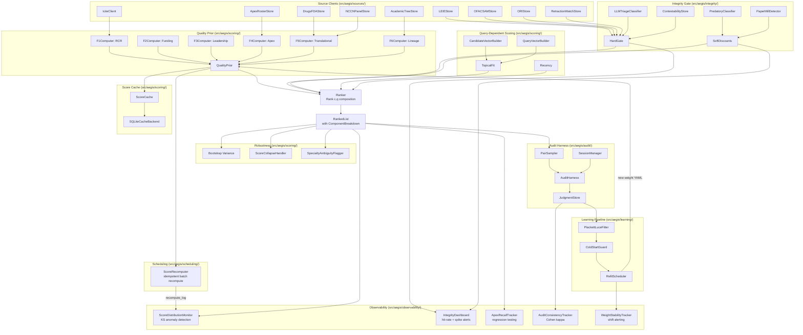

# Design: Scoring, Integrity, and Ranking

> **Last Updated:** 2026-04-27
> **Updated By:** design-updater (build: specs/aegis-phase3d-geographic-broadening.md)
> **Code Baseline:** pre-commit (no commits yet)

## Current Design

### Overview

The scoring and ranking domain produces a fully ranked list of research candidates for a specialty query, with a human-in-the-loop learning cycle that refines ranking exponents over time. The pipeline has four stages: (1) a query-independent quality prior Q(c) computed from six F-score dimensions, (2) an integrity gate I(c) that either hard-zeros a candidate or applies multiplicative soft discounts (with contestability overrides), (3) query-dependent topical-fit T(c,q) and recency R(c,q) scores, and (4) an end-to-end ranker that composes these into `Rank(c,q) = I(c) * Q(c)^alpha * T(c,q)^beta * R(c,q)^gamma`.

Phase 1c adds three new subsystems: (a) an **audit harness** (`src/aegis/audit/`) that collects pairwise expert judgments with active-learning pair sampling and JSONL persistence, (b) a **learning pipeline** (`src/aegis/learning/`) that fits Plackett-Luce exponents from those judgments using scipy L-BFGS-B, with a refit scheduler and cold-start guard, and (c) **robustness modules** for score-variance estimation via bootstrap resampling (`src/aegis/scoring/variance.py`), score-collapse detection with MeSH expansion fallback (`src/aegis/scoring/score_collapse.py`), specialty-ambiguity flagging (`src/aegis/scoring/specialty_flag.py`), and integrity false-positive contestability (`src/aegis/integrity/contestability.py`).

Phase 3d adds **geographic broadening** to reduce US-centricity in candidate ranking. Seven new typed source clients (WIPO, ERC, Horizon Europe, MRC, CIHR, JST/KAKEN, NSFC) ingest non-US patent and grant data via the shared `NonUsGrantRecord` model (`src/aegis/sources/non_us_grants.py`). The EPO client is extended with full member-state coverage across all 39 EPO states. A `Region` enum and `country_to_region()` utility derive geographic region from ROR-normalized affiliations. Per-region coverage diagnostics (`src/aegis/observability/regional_coverage.py`) compute region-level breakdowns with a 75% bias threshold that triggers API response caveats. Geographic-coverage tracking (`src/aegis/observability/geographic_tracking.py`) records per-region ratios over time via JSONL snapshots with trend analysis and regression alerting against a 40% non-US target. The KAKEN client supports Japanese name transliteration via `cutlet`, and the NSFC client marks all records with a coverage caveat for transparency. The ROR curated dataset is expanded to 102 entries covering JP, CN, GB, CA, EU, and AU institutions. A DuckDB migration (`004_grant_refs.sql`) adds the `grant_refs` table for non-US grant references.

Phase 1d adds **observability, performance, and caching infrastructure** without changing the core scoring pipeline. Five new observability modules track score distributions with KS anomaly detection (`src/aegis/observability/score_dist.py`), integrity-gate hit rates with spike alerting (`src/aegis/observability/integrity_dashboard.py`), apex-list recall regression (`src/aegis/observability/apex_recall.py`), pairwise audit consistency via Cohen's kappa (`src/aegis/observability/audit_consistency.py`), and weight stability across refit cycles (`src/aegis/observability/weight_stability.py`). On the performance side, a new **scheduling package** (`src/aegis/scheduling/`) provides idempotent batch score recomputation with artifact-set hashing (`src/aegis/scheduling/recompute.py`), and a **score cache** (`src/aegis/scoring/cache.py`) with a pluggable `CacheBackend` Protocol (SQLite default) accelerates repeated lookups. A latency budget enforces p95 < 500ms for top-50 ranked output (`tests/perf/test_query_latency.py`). Ops artifacts under `ops/aegis/` provide Prometheus-compatible alert rules and HTML dashboard templates.

The scoring package lives under `src/aegis/scoring/`, the integrity package under `src/aegis/integrity/`, the audit package under `src/aegis/audit/`, the learning package under `src/aegis/learning/`, the observability package under `src/aegis/observability/`, and the scheduling package under `src/aegis/scheduling/`. Integrity source clients (LEIE, OFAC/SAM, ORI, Retraction Watch) live under `src/aegis/sources/`. Weight configuration including exponents (alpha, beta, gamma) is versioned in YAML at `config/aegis/weights/`. Hard-zeroed candidates are excluded from ranked output but their gate results are retained for audit. Every ranked candidate includes a per-component breakdown for transparency.

### Architecture

### Key Files

| File | Role |
|------|------|
| `src/aegis/scoring/__init__.py` | Package exports for all scoring, ranking, vector, variance, collapse, and specialty classes |
| `src/aegis/scoring/quality_prior.py` | Q(c) composition via weighted geometric mean + percentile calibration |
| `src/aegis/scoring/f1_rcr.py` | F1: RCR aggregation with author-position weighting |
| `src/aegis/scoring/f2_funding.py` | F2: NIH funding weighted by PI role, grant type, activity status |
| `src/aegis/scoring/f3_leadership.py` | F3: Leadership composite from last-author rate, trial PI count, corresponding-author rate, editorial roles |
| `src/aegis/scoring/f4_apex.py` | F4: Apex-tier recognition via diminishing-returns score table |
| `src/aegis/scoring/f5_translational.py` | F5: Translational impact from FDA submissions, Phase 2+ trials, NCCN membership |
| `src/aegis/scoring/f6_lineage.py` | F6: Mentorship lineage from Academic Family Tree trainee and R01-trainee counts |
| `src/aegis/scoring/candidate_vector.py` | SparseVector class and CandidateVectorBuilder / QueryVectorBuilder for MeSH topic vectors |
| `src/aegis/scoring/topical_fit.py` | T(c,q): cosine similarity between L2-normalized candidate and query sparse vectors |
| `src/aegis/scoring/recency.py` | R(c,q): exponential time-decay sum over MeSH-overlapping artifacts with squash function |
| `src/aegis/scoring/rank.py` | End-to-end Ranker: composes I(c) * Q^alpha * T^beta * R^gamma, filters hard-zeros, sorts, formats |
| `src/aegis/scoring/result_format.py` | Pydantic output models: RankedList, RankedCandidate, ComponentBreakdown, ContributingArtifact |
| `src/aegis/scoring/variance.py` | Bootstrap Monte-Carlo score-variance estimation producing per-candidate ScoreBand (low/high/median) |
| `src/aegis/scoring/score_collapse.py` | Detects all-below-floor score collapse and applies MeSH parent expansion as fallback |
| `src/aegis/scoring/specialty_flag.py` | Rule-based specialty-ambiguity flagger (observability only in Phase 1, does not affect scores) |
| `src/aegis/integrity/__init__.py` | Integrity package exports: HardGate, SoftDiscounts, predatory, papermill, LLM triage, contestability |
| `src/aegis/integrity/hard_gate.py` | Hard-zero gate: 5 rules evaluated in order with short-circuit on first match |
| `src/aegis/integrity/soft_discounts.py` | Soft discount evaluator: multiplicative factors with per-type floors |
| `src/aegis/integrity/predatory.py` | PredatoryClassifier (MEDLINE/DOAJ/heuristic triangulation) and PredatoryLoadCalculator |
| `src/aegis/integrity/papermill.py` | PaperMillDetector: tortured-phrase scanning (Cabanac et al.) with batch analysis |
| `src/aegis/integrity/llm_triage.py` | LLMTriageClassifier: keyword-heuristic retraction-notice severity classification (Phase 1 fallback) |
| `src/aegis/integrity/contestability.py` | Append-only JSONL store for integrity false-positive override/revoke records |
| `src/aegis/audit/__init__.py` | Audit package exports: AuditHarness, PairSampler, JudgmentStore, SessionManager |
| `src/aegis/audit/harness.py` | PairSampler (active-learning weighted sampling), SessionManager (cooldowns), AuditHarness (facade) |
| `src/aegis/audit/storage.py` | JudgmentStore: append-only JSONL persistence for PairwiseJudgment records |
| `src/aegis/learning/__init__.py` | Learning package exports: PlackettLuceFitter, RefitScheduler, ColdStartGuard |
| `src/aegis/learning/plackett_luce.py` | Plackett-Luce MLE fitter using scipy L-BFGS-B with CI from inverse Hessian |
| `src/aegis/learning/refit_scheduler.py` | Cadence-based refit scheduler that writes new versioned weight YAML files |
| `src/aegis/learning/cold_start_guard.py` | Blocks deployment of unstable fits when N < 20 or CI half-widths exceed threshold |
| `src/aegis/sources/leie.py` | LEIEStore: in-memory HHS-OIG exclusion list with NPI and name lookup |
| `src/aegis/sources/ofac_sam.py` | OFACSAMStore: in-memory OFAC/SAM sanctions list with alias matching |
| `src/aegis/sources/ori.py` | ORIStore: in-memory ORI misconduct findings with 10-year recency check |
| `src/aegis/sources/retraction_watch.py` | RetractionWatchStore: in-memory retraction records with author/PMID lookup |
| `config/aegis/weights/translational_v1.yaml` | Weight vector v1: F-score weights (sum to 1.0) and exponents alpha=0.7, beta=1.0, gamma=0.4 |
| `data/aegis/editorial_roles_phase1.yaml` | Handcrafted editorial roles for 5 major NSCLC journals (Phase 1 only) |
| `src/aegis/observability/score_dist.py` | ScoreDistributionMonitor: 50-bucket histograms per component with KS-statistic anomaly detection, DuckDB persistence |
| `src/aegis/observability/integrity_dashboard.py` | IntegrityDashboard: per-day hard-zero and soft-discount event tracking with 3x-baseline spike detection |
| `src/aegis/observability/apex_recall.py` | ApexRecallTracker: curated apex query recall@50 tracking with weekly trend comparison and >=80% threshold |
| `src/aegis/observability/audit_consistency.py` | AuditConsistencyTracker: inter-reviewer Cohen's kappa, intra-reviewer reshow consistency, low-agreement flagging |
| `src/aegis/observability/weight_stability.py` | WeightStabilityTracker: per-parameter relative shift detection with 25% threshold and review template generation |
| `src/aegis/scheduling/recompute.py` | ScoreRecomputer: idempotent batch Q(c) and v_c recomputation with artifact-set hashing and DuckDB logging |
| `src/aegis/scoring/cache.py` | ScoreCache with CacheBackend Protocol and SQLiteCacheBackend: keyed by candidate UUID + artifact hash + weight version |
| `tests/perf/test_query_latency.py` | Performance benchmark: 100 trials x 100 candidates, asserts p95 < 500ms for end-to-end ranking |
| `ops/aegis/score_dist_alerts.yaml` | Prometheus alert rules: KS distribution shift, integrity spike, apex recall drop, weight shift |
| `ops/aegis/api_alerts.yaml` | Prometheus alert rules: API error rate, rate limiting, schema breaks, high latency |
| `ops/aegis/drift_alerts.yaml` | Prometheus alert rules: ingestion count drop >30%, z-score anomaly |
| `ops/aegis/weight_review.md` | Weight change approval workflow: manual review when any parameter shifts >25% |
| `src/aegis/sources/non_us_grants.py` | Shared NonUsGrantRecord model, Region enum, country_to_region() and candidate_region() utilities |
| `src/aegis/sources/wipo.py` | WIPO PATENTSCOPE client for PCT international patent applications |
| `src/aegis/sources/erc.py` | ERC grant client via CORDIS API |
| `src/aegis/sources/horizon_europe.py` | Horizon Europe grant client via CORDIS API |
| `src/aegis/sources/mrc.py` | MRC (UK) grant client via Gateway to Research API |
| `src/aegis/sources/cihr.py` | CIHR (Canada) grant client |
| `src/aegis/sources/jst_kaken.py` | JST/KAKEN (Japan) grant client with cutlet transliteration |
| `src/aegis/sources/nsfc.py` | NSFC (China) grant client with best-effort coverage caveat |
| `src/aegis/observability/regional_coverage.py` | Per-region coverage diagnostics with 75% bias threshold and API caveat |
| `src/aegis/observability/geographic_tracking.py` | Geographic-coverage tracking over time via JSONL snapshots with trend analysis |
| `src/aegis/storage/migrations/004_grant_refs.sql` | DuckDB migration for non-US grant references table |

### Patterns

Established patterns builders MUST follow in this domain:

- **FNComputer Interface**: Every F-score module exports an `FNComputer` class with two methods: `score_raw(input) -> tuple[...]` for raw computation and `compute_percentiles(raw_scores) -> dict[str, FNScore]` for cohort-relative percentile assignment. See `src/aegis/scoring/f1_rcr.py:53` for the canonical example.

- **FNScore Pydantic Model**: Every F-score module exports a frozen Pydantic `BaseModel` named `FNScore` with a `percentile: float` field (0.0-1.0) plus domain-specific fields. All use `ConfigDict(frozen=True)`. See `src/aegis/scoring/f1_rcr.py:11` for the canonical example.

- **Midpoint Percentile Assignment**: Percentiles are assigned using the midpoint method: `percentile = (rank_idx + 0.5) / n` where candidates are sorted by composite score. This avoids exact 0.0 or 1.0 percentiles. See `src/aegis/scoring/f1_rcr.py:128` and `src/aegis/scoring/quality_prior.py:118`.

- **Rank-Order Percentile (Alternative)**: F3 and F4 use a slightly different formula: `rank_idx / max(n - 1, 1)`, which produces exact 0.0 and 1.0 at the extremes. See `src/aegis/scoring/f3_leadership.py:110` and `src/aegis/scoring/f4_apex.py:73`.

- **Log-Space Computation**: Numeric quantities spanning orders of magnitude (RCR values, funding amounts) are transformed to log space before aggregation to prevent outlier dominance. See `src/aegis/scoring/f1_rcr.py:80` (`math.log(p.rcr + 1e-9)`) and `src/aegis/scoring/f2_funding.py:115` (`math.log(weighted_cost + 1.0)`).

- **Component Capping**: Individual sub-components within an F-score are capped at 1.0 using `min(value / cap, 1.0)` to prevent any single signal from dominating. See `src/aegis/scoring/f5_translational.py:46` (FDA capped at 3) and `src/aegis/scoring/f6_lineage.py:41` (trainees capped at 10).

- **In-Memory Source Stores (Phase 1)**: All integrity source clients (LEIE, OFAC/SAM, ORI, Retraction Watch) and scoring source clients (apex rosters, Drugs@FDA, NCCN, Academic Tree) use a simple in-memory store pattern with `add_batch()` for loading and lookup methods for querying. Phase 3 will add DB persistence and live APIs. See `src/aegis/sources/leie.py:28` and `src/aegis/sources/apex_rosters.py:37` for canonical examples.

- **Frozen Pydantic Models Throughout**: All data models use `from pydantic import BaseModel, ConfigDict` with `model_config = ConfigDict(frozen=True)`. See `src/aegis/integrity/hard_gate.py:28` (`ArtifactRef`), `src/aegis/scoring/result_format.py:8` (`ContributingArtifact`), `src/aegis/audit/storage.py:17` (`PairwiseJudgment`), `src/aegis/learning/plackett_luce.py:34` (`FittedWeights`).

- **Hard Gate Short-Circuit**: The `HardGate.evaluate()` method checks rules in a fixed order and returns immediately on the first match, recording `rules_evaluated` for audit. See `src/aegis/integrity/hard_gate.py:85` for the evaluation entry point.

- **Multiplicative Soft Discounts with Floor Enforcement**: Each soft discount type has a minimum floor value. Factors are computed independently, then combined by multiplication: `combined = product(d.factor for d in discounts)`. See `src/aegis/integrity/soft_discounts.py:140-142`.

- **Sparse Dict Vector Representation**: MeSH topic vectors use a dict-based `SparseVector` class (`dict[str, float]`) with L2-normalization. Cosine similarity reduces to a dot product on pre-normalized vectors. See `src/aegis/scoring/candidate_vector.py:21` for the class and `src/aegis/scoring/topical_fit.py:22` for the dot-product cosine.

- **Append-Only JSONL Stores**: Mutable audit data (pairwise judgments, contestability overrides) is persisted in append-only JSONL files. Each record is serialized via `model_dump_json()`, appended as one line, and flushed immediately. Loading re-parses all lines. See `src/aegis/audit/storage.py:38` (`JudgmentStore.append`) and `src/aegis/integrity/contestability.py:60` (`ContestabilityStore.add_override`) for the canonical pattern.

- **Active-Learning Pair Sampling**: The `PairSampler` weights candidate pairs by inverse score difference (`1 / (1 + |score_a - score_b|)`), biasing sampling toward pairs where the current ranker is most uncertain. Already-judged pairs are excluded. See `src/aegis/audit/harness.py:91` for the weight formula.

- **Scipy L-BFGS-B Optimization**: The Plackett-Luce fitter uses `scipy.optimize.minimize` with method `L-BFGS-B` and box constraints on exponents. Confidence intervals are derived from the inverse Hessian diagonal. See `src/aegis/learning/plackett_luce.py:157-163` for the minimize call.

- **Bootstrap Resampling for Score Variance**: The `Bootstrap` estimator draws exponent vectors from a multivariate normal posterior, computes candidate scores for each draw, and reports 2.5th/97.5th percentile bands. See `src/aegis/scoring/variance.py:79` for the multivariate normal draw and lines 104-106 for percentile extraction.

- **DuckDB Observability Persistence**: All observability monitors that track time-series data persist snapshots in DuckDB with upsert semantics (`INSERT ... ON CONFLICT DO UPDATE`). Each module creates its own table in `__init__` via `self._conn = duckdb.connect(db_path)` then `self._conn.execute(CREATE_TABLE)`. See `src/aegis/observability/score_dist.py:82-83` for the canonical example and `src/aegis/observability/integrity_dashboard.py:84-85` for the same pattern.

- **KS-Statistic Anomaly Detection**: Distribution shifts are detected by expanding persisted histograms into representative sample points (bucket midpoint repeated by count) and comparing via `scipy.stats.ks_2samp`. Scipy is imported lazily inside the method to avoid import-time cost. See `src/aegis/observability/score_dist.py:180` for the lazy import and `src/aegis/observability/score_dist.py:192` for the `ks_2samp` call.

- **Spike Detection via Rolling Baseline**: Integrity event spikes are detected by comparing the current day's count against the mean of the previous 14 days (`_SPIKE_WINDOW_DAYS`). A spike fires when `current_count > 3.0 * baseline_mean`. See `src/aegis/observability/integrity_dashboard.py:28-29` for the constants and `src/aegis/observability/integrity_dashboard.py:209` for the threshold comparison.

- **Pluggable Cache Backend via Protocol**: The score cache uses a `@runtime_checkable` Protocol (`CacheBackend`) with five methods: `get`, `set`, `delete`, `clear`, `size`. The default implementation is `SQLiteCacheBackend`. See `src/aegis/scoring/cache.py:53-75` for the Protocol definition and `src/aegis/scoring/cache.py:78-130` for the SQLite implementation.

- **Artifact-Set Hashing for Idempotency**: The score recomputer and cache key both use a deterministic SHA-256 hash of sorted artifact IDs to detect when a candidate's input data has changed. See `src/aegis/scheduling/recompute.py:68-74` for `compute_artifact_set_hash()` and `src/aegis/scoring/cache.py:12-27` for `CacheKey` which includes `artifact_set_hash`.

- **Weight Stability Gating**: The `WeightStabilityTracker` computes per-parameter relative change between consecutive weight versions and blocks auto-deployment when any parameter shifts >25%. See `src/aegis/observability/weight_stability.py:44-46` for the threshold constant and `src/aegis/observability/weight_stability.py:143` for the `requires_review` flag.

### Data Flow

1. **Raw data ingestion**: Source clients provide raw data. For quality scoring: `IciteClient`, `ApexRosterStore`, `DrugsFDAStore`, `NCCNPanelStore`, `AcademicTreeStore`. For integrity: `LEIEStore`, `OFACSAMStore`, `ORIStore`, `RetractionWatchStore`. All integrity stores are loaded via `add_batch()` and queried by name, NPI, or PMID.

2. **Quality prior Q(c)**: Six `FNComputer` modules each produce per-candidate percentiles. `QualityPrior` composes them into Q(c) via weighted geometric mean in log space (`src/aegis/scoring/quality_prior.py:65`).

3. **Hard gate evaluation**: `HardGate.evaluate()` at `src/aegis/integrity/hard_gate.py:85` checks five rules in order: (1) LEIE federal exclusion, (2) OFAC/SAM listing, (3) ORI misconduct within 10 years, (4) retraction for fabrication/falsification in target subdomain (MeSH Jaccard >= 0.6), (5) medical board action (Phase 1 stub). Short-circuits on first match, returning `HardGateResult` with `is_zero=True`. For rule 4, retraction notices are classified by `LLMTriageClassifier` which uses keyword heuristic matching in Phase 1 (`src/aegis/integrity/llm_triage.py:74`). Only fabrication and falsification severities trigger hard-zero (`src/aegis/integrity/hard_gate.py:20-23`).

4. **Integrity contestability**: `ContestabilityStore` at `src/aegis/integrity/contestability.py:35` provides an append-only JSONL override trail. A reviewer can submit an `override` or `revoke` action via `add_override()` (line 41). The `is_overridden()` method (line 65) checks whether the most recent action for a candidate is an override, allowing the hard gate result to be reversed without deleting audit history.

5. **Soft discount evaluation**: `SoftDiscounts.evaluate()` at `src/aegis/integrity/soft_discounts.py:76` computes four discount types: predatory-journal load (linear mapping with floor 0.5, `src/aegis/integrity/soft_discounts.py:90`), out-of-subdomain retractions (0.1 per retraction with floor 0.4, line 107), authorship inconsistency (Phase 1 stub), and paper-mill signals (fixed factor 0.7, line 128). Factors multiply to produce `combined_factor`. Predatory classification uses `PredatoryClassifier` at `src/aegis/integrity/predatory.py:26` which triangulates MEDLINE/DOAJ/Cabells/heuristic signals. Paper-mill detection uses `PaperMillDetector` at `src/aegis/integrity/papermill.py:58` which scans for tortured phrases from Cabanac et al.

6. **Topical fit T(c,q)**: `CandidateVectorBuilder.build()` at `src/aegis/scoring/candidate_vector.py:74` aggregates per-artifact MeSH weights (role * venue * recency * evidence_type) into a `SparseVector`, then L2-normalizes. `QueryVectorBuilder.build()` at line 97 creates the query vector. `TopicalFit.compute()` at `src/aegis/scoring/topical_fit.py:11` returns their dot product clamped to [0, 1].

7. **Recency R(c,q)**: `Recency.compute()` at `src/aegis/scoring/recency.py:29` filters artifacts by MeSH overlap with the query, applies exponential time-decay (`exp(-delta_years / tau)` where `tau = half_life / ln(2)`, half-life defaults to 3.0 years at line 10), weights by role, evidence type, and preprint discount (0.6, line 11), accumulates, then squashes via `1 - exp(-accumulator / squash_scale)` (line 69, default squash_scale 3.0).

8. **Rank composition**: `Ranker.rank()` at `src/aegis/scoring/rank.py:56` takes a list of `CandidateScoreInput` objects containing all component scores. Hard-zeroed candidates (flagged or integrity_score == 0.0) are excluded (line 70). For remaining candidates, `final = I(c) * Q^alpha * T^beta * R^gamma` (line 78) using `_safe_pow()` (line 130) which returns 0.0 for non-positive bases. Candidates are sorted descending by score, optionally top-k limited, and wrapped in `RankedCandidate` with full `ComponentBreakdown`. Default exponents match the YAML config: alpha=0.7, beta=1.0, gamma=0.4 (`src/aegis/scoring/rank.py:15-17` and `config/aegis/weights/translational_v1.yaml:14-16`).

9. **Score-collapse handling**: `ScoreCollapseHandler.handle_collapse()` at `src/aegis/scoring/score_collapse.py:65` detects when all candidate scores fall below a floor (default 0.05, line 8). If collapse is detected, it expands query MeSH terms to parent descriptors using a hardcoded parent map (line 11) and signals a retry. If the expanded query also collapses, `make_cohort_fallback()` (line 83) returns a cohort-level fallback result.

10. **Specialty-ambiguity flagging**: `SpecialtyAmbiguityFlagger.flag()` at `src/aegis/scoring/specialty_flag.py:36` computes a weighted specialty confidence from artifact ratios (0.5 * paper_ratio + 0.3 * trial_ratio + 0.2 * grant_ratio, line 56-58). Candidates below the threshold (default 0.6, line 12) are flagged as ambiguous. This is observability-only in Phase 1 and does not affect scores (`src/aegis/scoring/specialty_flag.py:5`).

11. **Score-variance estimation**: `Bootstrap.estimate()` at `src/aegis/scoring/variance.py:54` draws `n_samples` (default 200) exponent vectors from a multivariate normal distribution parameterized by the fitted posterior mean and covariance (`src/aegis/scoring/variance.py:79`). For each draw, candidate scores are recomputed using `I(c) * Q^alpha * T^beta * R^gamma` with the sampled exponents (lines 97-102). The 2.5th and 97.5th percentiles of the score distribution form the 95% confidence band (`ScoreBand` model, line 12).

12. **Audit learning loop**: The `AuditHarness` facade at `src/aegis/audit/harness.py:178` coordinates pairwise expert review. `PairSampler.sample_pairs()` (line 49) generates informative pairs with active-learning bias. `SessionManager` (line 138) enforces per-reviewer pair limits (default 20) and cooldowns (default 60 min). Judgments are persisted to `JudgmentStore` (line 30 of `storage.py`) as append-only JSONL. Inter-reviewer agreement is tracked via Cohen's kappa at `AuditHarness.inter_reviewer_kappa()` (line 215).

13. **Weight fitting**: `PlackettLuceFitter.fit()` at `src/aegis/learning/plackett_luce.py:113` converts `JudgmentRecord` pairs into a Plackett-Luce log-likelihood (line 88) and optimizes exponents (alpha, beta, gamma) via scipy L-BFGS-B with box constraints (line 157). Confidence intervals are derived from the inverse Hessian diagonal (line 210). The `ColdStartGuard.evaluate()` at `src/aegis/learning/cold_start_guard.py:33` blocks deployment if: the fit did not converge, N < 20 judgments (line 55), or any CI half-width exceeds a threshold (default 0.2, line 30).

14. **Refit scheduling**: `RefitScheduler.should_refit()` at `src/aegis/learning/refit_scheduler.py:62` checks whether enough time has elapsed based on cadence (cold_start: 7 days, steady_state: 30 days, line 30-33). `execute_refit()` (line 74) runs the fitter, writes a new versioned YAML file (e.g., `translational_v2.yaml`), and bumps the internal version counter. `rollback()` (line 122) loads a prior weight version by version number.

15. **Output**: `RankedList` at `src/aegis/scoring/result_format.py:49` contains `query_mesh_terms`, `cohort_size`, `result_count`, `candidates` (list of `RankedCandidate`), `excluded_count`, `weight_version`, `exponents`, and `metadata`. Each `RankedCandidate` (line 34) includes `rank`, `score`, `breakdown` (`ComponentBreakdown` at line 19 with raw and powered values for each component), `top_artifacts`, and `evidence_trail`.

16. **Score caching**: `ScoreCache` at `src/aegis/scoring/cache.py:133` wraps a `CacheBackend` Protocol (`src/aegis/scoring/cache.py:54`) with hit/miss tracking. Cache keys are `(candidate_uuid, artifact_set_hash, weight_version)` serialized to a deterministic string (`src/aegis/scoring/cache.py:22-27`). The default `SQLiteCacheBackend` at line 78 stores JSON-encoded `CachedScore` payloads (quality_score_raw, quality_percentile, vector_data) in a single SQLite table. `get_stats()` (line 165) returns `CacheStats` with hit rate for monitoring.

17. **Score recomputation**: `ScoreRecomputer` at `src/aegis/scheduling/recompute.py:61` provides idempotent batch recomputation. For each candidate, `compute_artifact_set_hash()` (line 68) produces a SHA-256 of sorted artifact IDs. `is_up_to_date()` (line 76) checks the `recompute_log` DuckDB table for a matching `(candidate_uuid, artifact_set_hash, weight_version)` tuple. If current, the candidate is skipped. Otherwise, `recompute_candidate()` (line 92) rebuilds Q(c) and v_c and the result is persisted. `recompute_batch()` (line 138) orchestrates the full cohort with skip/recompute/fail counters.

18. **Score-distribution monitoring**: `ScoreDistributionMonitor` at `src/aegis/observability/score_dist.py:74` computes 50-bucket histograms (`_NUM_BUCKETS = 50`, line 27) for each of 10 score components (`COMPONENTS` list at line 14: F1-F6 percentiles, quality_prior, topical_fit, recency, rank). Snapshots are persisted in the `score_distribution_snapshots` DuckDB table (line 29). `check_ks_anomaly()` (line 167) reconstructs empirical distributions from histogram bins via `_expand_histogram()` (line 318) and compares consecutive snapshots using `scipy.stats.ks_2samp` (line 192). Alerts fire at KS > 0.1 (default threshold), with severity "critical" above 0.3 and "warning" otherwise (line 198).

19. **Integrity-gate hit-rate dashboard**: `IntegrityDashboard` at `src/aegis/observability/integrity_dashboard.py:80` records per-day hard-zero and soft-discount events in the `integrity_events` DuckDB table (line 31). `get_daily_summary()` (line 138) aggregates counts by type and reason. `check_spike()` (line 170) compares the current day's count against the 14-day rolling baseline mean (`_SPIKE_WINDOW_DAYS = 14`, line 28); a spike fires when `current_count > 3.0 * baseline_mean` (`_SPIKE_MULTIPLIER = 3.0`, line 29). HTML reports include weekly summary tables and spike alert sections.

20. **Apex recall regression**: `ApexRecallTracker` at `src/aegis/observability/apex_recall.py:65` loads curated apex queries from YAML (line 72), computes recall as `|intersection| / |expected|` (line 97), and persists results to the `apex_recall_results` DuckDB table. `get_weekly_trend()` (line 127) compares recall between two dates and flags regressions where `delta < -0.05` (line 152). `passes_threshold()` (line 178) checks that mean recall across queries meets the >=80% bar (default threshold 0.80, line 183).

21. **Audit consistency tracking**: `AuditConsistencyTracker` at `src/aegis/observability/audit_consistency.py:36` operates in-memory on `JudgmentRecord` lists. It identifies overlapping pairs judged by multiple reviewers (line 56), computes inter-reviewer Cohen's kappa via `compute_kappa()` (line 102), and tracks intra-reviewer consistency from reshow pairs. `should_reshow()` (line 47) determines 5% reshow rate (`reshow_rate=0.05` default, line 41). `compute_report()` (line 131) produces a `ConsistencyReport` with kappa values, per-reviewer agreement rates, and a list of low-agreement reviewers below the 0.6 threshold (line 45).

22. **Weight-stability tracking**: `WeightStabilityTracker` at `src/aegis/observability/weight_stability.py:39` compares consecutive weight YAML versions. `compare_vectors()` (line 78) computes per-parameter absolute and relative changes. `check_latest_stability()` (line 118) finds the two highest `translational_v*.yaml` files and builds a `StabilityReport`. A shift exceeding 25% (`shift_threshold_pct=25.0`, line 44) sets `requires_review=True` and `auto_deploy_ok=False` (line 143-144). `generate_review_template()` (line 170) produces a Markdown approval workflow.

23. **Ops artifacts and alerting**: Prometheus-compatible alert rules are defined in YAML files under `ops/aegis/`. `score_dist_alerts.yaml` fires on KS > 0.1 (`AegisScoreDistributionShift`), integrity spike > 3x baseline (`AegisIntegrityHitRateSpike`), apex recall drop > 5% (`AegisApexRecallDrop`), and weight shift > 25% (`AegisWeightShiftLarge`). `api_alerts.yaml` fires on API error rate > 10% (`AegisApiHighErrorRate`), rate limiting (`AegisApiRateLimited`), schema breaks (`AegisApiSchemaBreak`), and p95 latency > 5s (`AegisApiHighLatency`). `drift_alerts.yaml` fires on ingestion drops > 30% (`AegisIngestionDrop`) and z-score anomalies > 2.0 (`AegisIngestionAnomaly`).

24. **Latency budget enforcement**: The performance test at `tests/perf/test_query_latency.py:104` benchmarks 100 queries against a synthetic 100-candidate cohort. Each trial computes T(c,q) and R(c,q) for all candidates, then ranks top-50. The test asserts p95 latency < 500ms (`_P95_LIMIT_MS = 500.0`, line 27).

---

## Design Decisions

### 2026-04-26 -- Geometric-Mean Composition for Q(c)

- **Context**: The system needs to combine six heterogeneous quality dimensions (F1-F6) into a single composite score. The composition function must handle dimensions measured on different scales and penalize candidates who are strong on one dimension but weak on others.
- **Options Considered**:
  - Weighted arithmetic mean: simple but does not penalize imbalance; a candidate scoring 0.0 on one dimension and 1.0 on another gets a moderate score.
  - Weighted geometric mean: `Q(c) = prod(F_i^{w_i})` -- penalizes spiky profiles because the geometric mean is always less than or equal to the arithmetic mean, with equality only when all inputs are equal.
  - Rank aggregation (Borda, Copeland): more robust to outliers but loses the magnitude information encoded in percentiles.
  - **Chosen**: Weighted geometric mean -- it naturally penalizes imbalance across dimensions while preserving the interpretability of the component percentiles.
- **Rationale**: The geometric mean ensures a candidate cannot compensate for a zero in one dimension by excelling in another. This aligns with the domain requirement that quality prior should reflect broad competence rather than narrow excellence. The test at `src/aegis/scoring/quality_prior_test.py:145` (`test_geometric_mean_punishes_spiky`) explicitly validates this property: a balanced candidate (0.5, 0.5) scores higher than a spiky one (0.9, 0.1).
- **Tradeoffs Accepted**: Geometric mean is sensitive to near-zero percentiles; a single F-score near 0 can drive Q(c) to near-zero. This is mitigated by clamping component percentiles to a minimum of 1e-6 at `src/aegis/scoring/quality_prior.py:80`.
- **Code Evidence**: `src/aegis/scoring/quality_prior.py:65-88` -- `compute_raw()` implements `Q(c) = exp(sum(w_i * log(p_i)))` in log space.
- **Build**: `specs/aegis-phase1a-scoring-foundation.md`

### 2026-04-26 -- Log-Space Computation for Numerical Stability

- **Context**: The weighted geometric mean `prod(F_i^{w_i})` involves multiplying many fractional values raised to fractional powers. Direct computation in real space causes floating-point underflow for large cohorts where many F-scores are small fractions.
- **Options Considered**:
  - Direct computation: `result *= percentile ** weight` in a loop -- simple but prone to underflow.
  - **Chosen**: Log-space computation: `log_sum += weight * log(percentile)`, then `exp(log_sum)` -- numerically stable, avoids underflow entirely.
- **Rationale**: Log-space converts products to sums and powers to multiplications, which are well-behaved in IEEE 754 floating point. The same pattern is used in F1 (RCR aggregation in log space) and F2 (funding cost in log space).
- **Tradeoffs Accepted**: Requires clamping inputs away from zero to avoid `log(0)`. F1 uses `log(rcr + 1e-9)` at `src/aegis/scoring/f1_rcr.py:80`; F2 uses `log(cost + 1.0)` at `src/aegis/scoring/f2_funding.py:115`; Q(c) uses `max(percentile, 1e-6)` at `src/aegis/scoring/quality_prior.py:80`.
- **Code Evidence**: `src/aegis/scoring/quality_prior.py:74-88` -- the log-sum-exp pattern for geometric mean computation.
- **Build**: `specs/aegis-phase1a-scoring-foundation.md`

### 2026-04-26 -- Midpoint Percentile Calibration Method

- **Context**: After computing raw Q(c) or raw F-scores, the system needs to convert absolute values to cohort-relative percentiles. The percentile assignment method affects output stability and interpretability.
- **Options Considered**:
  - Simple rank division: `rank / n` -- produces exact 0.0 for the lowest candidate, which is problematic for downstream geometric mean (log(0) is undefined).
  - Empirical CDF: more theoretically grounded but computationally heavier for large cohorts.
  - **Chosen**: Midpoint method: `percentile = (rank_idx + 0.5) / n` -- avoids exact 0.0 or 1.0, provides uniformly spaced percentiles for uniformly distributed inputs.
- **Rationale**: The midpoint method is a standard statistical technique that provides unbiased percentile estimates. It guarantees no candidate receives exactly 0.0 (which would destroy Q(c) via the geometric mean) or exactly 1.0. The test at `src/aegis/scoring/quality_prior_test.py:85` validates that 100 candidates with linearly spaced inputs produce approximately uniform percentiles.
- **Tradeoffs Accepted**: F3 and F4 use the alternative formula `rank_idx / max(n-1, 1)` which does produce exact 0.0 and 1.0. This inconsistency exists because F3/F4 percentiles are inputs to Q(c) where the 1e-6 clamping in `compute_raw` handles the zero case. Future work should unify the percentile method.
- **Code Evidence**: `src/aegis/scoring/quality_prior.py:118` and `src/aegis/scoring/f1_rcr.py:128` use `(rank_idx + 0.5) / n`; `src/aegis/scoring/f3_leadership.py:110` and `src/aegis/scoring/f4_apex.py:73` use `rank_idx / max(n - 1, 1)`.
- **Build**: `specs/aegis-phase1a-scoring-foundation.md`

### 2026-04-26 -- Author-Position Weighting Scheme for F1

- **Context**: Not all author positions on a publication carry equal credit. Senior researchers typically appear as last or corresponding author, while trainees appear as first author and collaborators as middle authors.
- **Options Considered**:
  - Equal weighting: treats all positions the same -- simple but does not reflect actual credit norms in biomedical research.
  - Binary senior/junior: only last author counts -- too coarse, loses signal from first-author papers.
  - **Chosen**: Graded 4-tier scheme: last/corresponding = 1.0, first = 0.7, middle = 0.3.
- **Rationale**: The chosen weights reflect standard credit norms in biomedical research: the last and corresponding author positions indicate intellectual leadership (full credit), first author indicates primary execution (high but not full credit), and middle positions indicate collaboration (partial credit). These weights apply multiplicatively to log(RCR) values.
- **Tradeoffs Accepted**: The weight values are heuristic cold-start priors, not learned from data. Phase 1c will introduce a weight-learning loop. The weights are defined as module-level constants, making them easy to find and adjust.
- **Code Evidence**: `src/aegis/scoring/f1_rcr.py:24-27` -- `AUTHOR_WEIGHT_LAST = 1.0`, `AUTHOR_WEIGHT_CORRESPONDING = 1.0`, `AUTHOR_WEIGHT_FIRST = 0.7`, `AUTHOR_WEIGHT_MIDDLE = 0.3`.
- **Build**: `specs/aegis-phase1a-scoring-foundation.md`

### 2026-04-26 -- Component Capping Strategy for F5 and F6

- **Context**: F5 (translational impact) and F6 (mentorship lineage) combine multiple sub-components (FDA submissions, Phase 2+ trials, NCCN membership for F5; traceable trainees, R01 trainees for F6). Raw counts vary widely and a single extreme value could dominate the composite.
- **Options Considered**:
  - No capping: let raw counts drive the score -- allows outliers to dominate and makes the score distribution heavy-tailed.
  - Percentile-based normalization: requires the full cohort at component level -- adds complexity and coupling.
  - **Chosen**: Fixed-cap normalization: `min(count / cap, 1.0)` where cap values are domain-specific constants (FDA: 3, trials: 5, trainees: 10, R01 trainees: 5). Each capped component contributes a 0.0-1.0 value to a weighted composite.
- **Rationale**: Fixed caps provide predictable, interpretable behavior. A candidate with 3+ FDA submissions gets full credit on that component; additional submissions do not increase the score. The cap values were chosen to represent "clearly exceptional" thresholds for each signal. The composites use interpretable weights (F5: 0.35 FDA + 0.40 trials + 0.25 NCCN; F6: 0.4 trainees + 0.6 R01 trainees).
- **Tradeoffs Accepted**: Fixed caps are heuristic. If the cohort is unusually high-performing, the caps may be too low and compress the upper range. The test at `src/aegis/scoring/f5_translational_test.py:88` (`test_component_capping`) validates that values exceeding the cap are properly clamped.
- **Code Evidence**: `src/aegis/scoring/f5_translational.py:46-48` -- `min(fda_count / 3.0, 1.0)`, `min(trials / 5.0, 1.0)`; `src/aegis/scoring/f6_lineage.py:41-42` -- `min(trainees / 10.0, 1.0)`, `min(r01_trainees / 5.0, 1.0)`.
- **Build**: `specs/aegis-phase1a-scoring-foundation.md`

### 2026-04-26 -- Versioned Weight Configuration via YAML

- **Context**: The weights in the geometric-mean composition `Q(c) = prod(F_i^{w_i})` are cold-start heuristic priors that will be learned and updated over time via the Phase 1c weight-learning loop. The system needs a way to version, track, and swap weight configurations.
- **Options Considered**:
  - Hardcoded constants in Python: simplest but makes versioning and A/B testing difficult.
  - Database-stored config: more flexible but adds infrastructure dependency for a config that changes rarely.
  - **Chosen**: YAML file at a versioned path (`config/aegis/weights/translational_v1.yaml`) loaded at runtime via `load_weight_vector()`. The `WeightVector` Pydantic model captures version, specialty, weights, exponents, and exponent bounds. The version number propagates to `QualityScore.weight_version` for traceability.
- **Rationale**: YAML is human-readable, diff-friendly, and already a project dependency. The versioned file path convention (`v1`, `v2`, ...) supports the Phase 1c learning loop where new weights are written as new versions. The `WeightVector` model validates schema at load time.
- **Tradeoffs Accepted**: No runtime hot-reloading -- changing weights requires restarting the scoring pipeline. This is acceptable for Phase 1 where weight updates are infrequent.
- **Code Evidence**: `config/aegis/weights/translational_v1.yaml` -- the v1 config with weights summing to 1.0; `src/aegis/scoring/quality_prior.py:15-25` -- `WeightVector` model; `src/aegis/scoring/quality_prior.py:38-51` -- `load_weight_vector()` function; `src/aegis/scoring/quality_prior.py:123` -- version propagated to `QualityScore.weight_version`.
- **Build**: `specs/aegis-phase1a-scoring-foundation.md`

### 2026-04-26 -- In-Memory Source Stores for Phase 1

- **Context**: F4 (apex rosters), F5 (Drugs@FDA, NCCN panels), and F6 (Academic Tree) require reference data that does not come from existing API clients. These data sources have different access patterns and update frequencies. Phase 1b adds four integrity source clients (LEIE, OFAC/SAM, ORI, Retraction Watch) with the same requirement.
- **Options Considered**:
  - Live API clients for all sources: ideal but several sources lack public APIs (NCCN panels, Academic Family Tree bulk data) or have rate limits that complicate batch processing.
  - DuckDB persistence: consistent with the existing CandidateStore pattern but over-engineered for Phase 1 where data volumes are small (hundreds to low thousands of records).
  - **Chosen**: Simple in-memory stores with `add_batch()` for loading and lookup methods for querying. Each store is a class with an internal list that supports linear scan. Phase 3 will add DB persistence and live API integration.
- **Rationale**: In-memory stores are the simplest possible implementation for Phase 1 data volumes. The stores expose the same conceptual interface (add/lookup) that future DB-backed implementations will provide, so the scoring and integrity modules will not need to change.
- **Tradeoffs Accepted**: Linear scan lookup is O(n) per query. This is acceptable for Phase 1 cohort sizes (hundreds of candidates) but will not scale to Phase 3 production volumes without indexing.
- **Code Evidence**: `src/aegis/sources/apex_rosters.py:37-85` -- `ApexRosterStore`; `src/aegis/sources/leie.py:28` -- `LEIEStore` with NPI index; `src/aegis/sources/ofac_sam.py:25` -- `OFACSAMStore` with alias matching; `src/aegis/sources/ori.py:26` -- `ORIStore` with recency filter; `src/aegis/sources/retraction_watch.py:28` -- `RetractionWatchStore` with PMID index.
- **Build**: `specs/aegis-phase1a-scoring-foundation.md` (original), updated for `specs/aegis-phase1b-integrity-ranking.md`

### 2026-04-26 -- F4 Diminishing-Returns Score Table for Apex Memberships

- **Context**: F4 measures apex-tier recognition by counting memberships across 7 roster types (HHMI Investigator, NAS, NAE, NAM, NIH MERIT, Lasker, Hanna Gray). The raw count needs to be mapped to a 0.0-1.0 score. More memberships should always increase the score, but the marginal value of each additional membership decreases.
- **Options Considered**:
  - Linear mapping: `min(count / max_count, 1.0)` -- does not capture diminishing returns.
  - Logarithmic: `log(count + 1) / log(max + 1)` -- smooth but less interpretable.
  - **Chosen**: Lookup table with explicit diminishing-returns values: `{0: 0.0, 1: 0.4, 2: 0.65, 3: 0.8, 4: 0.9, 5+: 1.0}`. This gives large jumps for the first few memberships and saturates quickly.
- **Rationale**: A hand-tuned lookup table makes the diminishing-returns curve explicit and easy to inspect. The first membership provides the biggest signal (0.0 to 0.4), because having any apex recognition is highly discriminative. Subsequent memberships provide less additional signal. The curve saturates at 5+ memberships because having more than 4 apex recognitions is rare and additional ones do not meaningfully differentiate candidates.
- **Tradeoffs Accepted**: The table values are heuristic. The test at `src/aegis/scoring/f4_apex_test.py:49` (`test_monotonic`) verifies the monotonicity property.
- **Code Evidence**: `src/aegis/scoring/f4_apex.py:12-18` -- `_SCORE_TABLE` lookup; `src/aegis/scoring/f4_apex.py:23-29` -- `_membership_score()` function.
- **Build**: `specs/aegis-phase1a-scoring-foundation.md`

### 2026-04-26 -- Jaccard Similarity for Subdomain Retraction MeSH Overlap

- **Context**: The hard gate needs to determine whether a candidate's retraction is in the target subdomain. Only in-subdomain fabrication/falsification retractions trigger a hard-zero; out-of-subdomain retractions receive a softer treatment. The system needs a similarity metric to compare a candidate's MeSH profile against the query's MeSH terms.
- **Options Considered**:
  - Cosine similarity: the same metric used for topical fit T(c,q). However, for subdomain overlap checking we are comparing unweighted sets (presence/absence of MeSH terms), not weighted vectors. Cosine on binary vectors is equivalent to the Ochiai coefficient, which does not penalize set-size differences.
  - **Chosen**: Jaccard similarity: `|A intersection B| / |A union B|` with a threshold of 0.6. Jaccard naturally handles set-size imbalance and is a standard choice for set overlap.
- **Rationale**: The gate asks "is this retraction in the same research area?" which is fundamentally a set-overlap question, not a vector-similarity question. Jaccard at 0.6 requires substantial overlap (more than half the union) to trigger, which reduces false positives from researchers who work across multiple subdomains. Empty sets produce 0.0, avoiding division-by-zero issues.
- **Tradeoffs Accepted**: The 0.6 threshold is a heuristic. Lowering it increases sensitivity (catches more in-subdomain retractions) but risks false positives for multi-domain researchers. The threshold is a module-level constant for easy tuning.
- **Code Evidence**: `src/aegis/integrity/hard_gate.py:50-56` -- `_jaccard_mesh()` function; `src/aegis/integrity/hard_gate.py:25` -- `_MESH_OVERLAP_THRESHOLD = 0.6`; `src/aegis/integrity/hard_gate.py:151` -- threshold comparison in rule 4.
- **Build**: `specs/aegis-phase1b-integrity-ranking.md`

### 2026-04-26 -- Sparse Dict Representation for MeSH Topic Vectors

- **Context**: Topical fit T(c,q) requires representing candidate and query topic profiles as vectors over the MeSH descriptor vocabulary. The MeSH vocabulary has ~30,000 descriptors, but any given candidate or query typically uses only dozens to a few hundred terms. The system needs a vector representation that supports efficient dot product and L2 normalization.
- **Options Considered**:
  - Dense numpy array: standard for numerical computing but wasteful for sparse data. A 30,000-element float64 array per candidate uses ~240KB, and most entries are zero. Dot product is fast but memory scales with vocabulary size times cohort size.
  - **Chosen**: Dict-based sparse vector (`dict[str, float]`): only stores non-zero dimensions. Memory scales with the number of non-zero terms per vector (typically 50-200). Dot product iterates over the smaller dict's keys with O(min(|A|, |B|)) lookups.
- **Rationale**: For typical MeSH vectors with 50-200 non-zero terms out of 30,000 total, the dict representation is orders of magnitude more memory-efficient than a dense array. The `SparseVector` class provides `add()`, `dot()`, `l2_norm()`, and `normalize()` methods that are sufficient for cosine similarity computation. String keys (MeSH descriptor names) provide natural interpretability during debugging.
- **Tradeoffs Accepted**: Dict-based dot product has higher per-element overhead than numpy array operations. For Phase 1 cohort sizes (hundreds of candidates) this is negligible. If Phase 3 requires scoring thousands of candidates, the implementation can be swapped for scipy sparse or numpy arrays without changing the `TopicalFit` interface.
- **Code Evidence**: `src/aegis/scoring/candidate_vector.py:21-68` -- `SparseVector` class with `_data: dict[str, float]`; `src/aegis/scoring/candidate_vector.py:50-60` -- `dot()` iterates smaller dict; `src/aegis/scoring/candidate_vector.py:43-48` -- `normalize()` L2-normalizes in place.
- **Build**: `specs/aegis-phase1b-integrity-ranking.md`

### 2026-04-26 -- Multiplicative Soft Discount Combination

- **Context**: The integrity gate's soft discount layer needs to combine multiple independent discount factors (predatory load, out-of-subdomain retractions, paper-mill signals, authorship inconsistency) into a single I(c) multiplier. The combination method determines how multiple integrity concerns interact.
- **Options Considered**:
  - Additive penalty: `I(c) = 1.0 - sum(penalties)` -- simple but can produce negative values when multiple penalties accumulate; requires additional clamping.
  - Minimum-of-factors: `I(c) = min(factors)` -- only the worst discount applies, ignoring cumulative risk from multiple concerns.
  - **Chosen**: Multiplicative combination: `I(c) = product(factors)`. Each factor is in (0, 1] with a per-type floor. The product naturally decreases as more concerns accumulate, and each additional concern has diminishing marginal impact.
- **Rationale**: Multiplication preserves the independence assumption between discount types. A candidate with both predatory publications and paper-mill signals receives a harsher penalty than one with either alone, but the compound effect is bounded (never exceeds the product of individual floors). The per-type floors prevent any single discount from driving I(c) below a reasonable minimum. For example, predatory_floor=0.5 and papermill_floor=0.7 produce a worst-case combined floor of 0.35.
- **Tradeoffs Accepted**: The multiplicative approach can compound heavily if many discounts apply simultaneously. This is considered acceptable because candidates with multiple integrity concerns should indeed receive substantial penalties. There is no global floor on the combined factor.
- **Code Evidence**: `src/aegis/integrity/soft_discounts.py:140-142` -- `combined *= d.factor` loop; `src/aegis/integrity/soft_discounts.py:16-19` -- per-type floor constants: `PREDATORY_FLOOR = 0.5`, `RETRACTION_FLOOR = 0.4`, `AUTHORSHIP_INCONSISTENCY_FLOOR = 0.85`, `PAPERMILL_PENDING_FLOOR = 0.7`.
- **Build**: `specs/aegis-phase1b-integrity-ranking.md`

### 2026-04-26 -- Short-Circuit Evaluation in Hard Gate

- **Context**: The hard gate evaluates up to five binary exclusion rules per candidate. If any rule triggers, the candidate is excluded with I(c) = 0. The system needs to decide whether to evaluate all rules or stop on the first match.
- **Options Considered**:
  - Evaluate all rules: captures all exclusion reasons for audit but wastes computation after the first match. More complex output model (list of reasons vs. single reason).
  - **Chosen**: Short-circuit on first match: return immediately when a rule triggers, reporting only the first (and most severe) reason. The `rules_evaluated` field in `HardGateResult` records how many rules were checked.
- **Rationale**: The rules are ordered by severity and data reliability: LEIE (federal exclusion) is the most authoritative, followed by OFAC/SAM (sanctions), ORI (misconduct), retraction (requires triage), and medical board (Phase 1 stub). Short-circuiting on the most authoritative match provides the strongest justification for exclusion. The `rules_evaluated` count enables performance monitoring and ensures auditability even when short-circuiting.
- **Tradeoffs Accepted**: A candidate excluded by LEIE will not have their retraction history evaluated, so the audit trail only shows the LEIE reason. This is acceptable because the LEIE exclusion alone is sufficient justification, and evaluating further rules would not change the outcome.
- **Code Evidence**: `src/aegis/integrity/hard_gate.py:96-114` -- Rule 1 returns immediately if LEIE match; `src/aegis/integrity/hard_gate.py:117-129` -- Rule 2 returns on OFAC/SAM match; `src/aegis/integrity/hard_gate.py:47` -- `rules_evaluated: int` field in `HardGateResult`.
- **Build**: `specs/aegis-phase1b-integrity-ranking.md`

### 2026-04-26 -- Keyword Heuristic as LLM Fallback for Retraction Triage (Phase 1)

- **Context**: The hard gate needs to classify retraction notices into severity categories (fabrication, falsification, honest error, duplicate publication) to determine whether a retraction triggers hard-zero exclusion. The spec calls for LLM-based classification, but Phase 1 has no LLM infrastructure provisioned.
- **Options Considered**:
  - Defer retraction triage entirely: skip rule 4 in Phase 1 -- leaves a gap in integrity coverage.
  - Integrate a real LLM API: adds infrastructure complexity, API key management, latency, and cost for a Phase 1 prototype.
  - **Chosen**: Keyword-based heuristic fallback: scan retraction notice text for severity-indicating keywords (e.g., "fabricat", "falsif", "manipulat", "honest error", "overlapping publication"). Match to the first keyword found, ordered by severity. Default to "unclassifiable" with confidence 0.5 if no keyword matches.
- **Rationale**: The keyword heuristic provides a functional retraction-triage pipeline that exercises the full hard-gate architecture without LLM dependencies. Confidence values (0.8 for keyword match, 0.9 for missing text, 0.5 for unclassifiable) are conservative. The `LLMTriageClassifier` class is designed for Phase 2 replacement: the `classify()` method signature and `TriageResult` output model will not change when real LLM integration is added.
- **Tradeoffs Accepted**: Keyword matching is crude and will miss nuanced retraction notices. The "unclassifiable" default with discount 0.7 (from `SEVERITY_DISCOUNT_MAP`) provides a soft penalty for ambiguous cases rather than ignoring them. False negatives (missing a fabrication retraction) are more concerning than false positives in this context.
- **Code Evidence**: `src/aegis/integrity/llm_triage.py:47-64` -- `_KEYWORD_MAP` ordered severity-to-keywords list; `src/aegis/integrity/llm_triage.py:83-95` -- `classify()` method iterating keywords; `src/aegis/integrity/llm_triage.py:37-44` -- `SEVERITY_DISCOUNT_MAP` mapping severities to discount factors.
- **Build**: `specs/aegis-phase1b-integrity-ranking.md`

### 2026-04-26 -- Plackett-Luce over Bradley-Terry for Exponent Learning

- **Context**: The system needs to learn ranking exponents (alpha, beta, gamma) from pairwise expert judgments. Two standard models for pairwise comparison data are Bradley-Terry and Plackett-Luce. Both model the probability that item A beats item B as proportional to a strength parameter, but they differ in how they parameterize strength.
- **Options Considered**:
  - Bradley-Terry: models `P(A > B) = strength_A / (strength_A + strength_B)` where each item has a single scalar strength. Simple but requires a separate model to map component scores to strength, losing the interpretable exponent structure.
  - **Chosen**: Plackett-Luce with parameterized scoring: `P(winner) = S(winner) / (S(winner) + S(loser))` where `S(c) = Q^alpha * T^beta * R^gamma` (`src/aegis/learning/plackett_luce.py:59-70`). This directly fits the exponents that appear in the ranking formula, so the learned parameters are immediately deployable.
- **Rationale**: By defining the Plackett-Luce strength function as the same `Q^alpha * T^beta * R^gamma` formula used by the ranker, the fitter directly produces the exponents the ranker needs. There is no separate mapping layer. The negative log-likelihood (line 88) sums over all judgments and is minimized via L-BFGS-B with box constraints (line 157), which naturally enforces the exponent bounds defined in the weight config.
- **Tradeoffs Accepted**: The Plackett-Luce model assumes independence of irrelevant alternatives (IIA), which may not hold if reviewers are influenced by context. The model also assumes component scores are fixed inputs, ignoring uncertainty in Q, T, R themselves. These assumptions are standard for Phase 1 and can be relaxed in future phases with more sophisticated models.
- **Code Evidence**: `src/aegis/learning/plackett_luce.py:59-70` -- `_compute_score()` using `Q^alpha * T^beta * R^gamma`; `src/aegis/learning/plackett_luce.py:88-111` -- `_neg_log_likelihood()` Plackett-Luce likelihood; `src/aegis/learning/plackett_luce.py:157-163` -- `scipy.optimize.minimize` with method `L-BFGS-B`.
- **Build**: `specs/aegis-phase1c-audit-learning.md`

### 2026-04-26 -- JSONL Append-Only Storage over Database for Judgments and Overrides

- **Context**: The audit harness and contestability module need to persist mutable data (pairwise judgments, integrity overrides). The storage must support append operations, full-scan reads, and provide an immutable audit trail.
- **Options Considered**:
  - SQLite or DuckDB: structured queries, indexing, ACID transactions. But adds a runtime dependency and schema migration burden for data that is naturally append-only and small in volume (hundreds to low thousands of records in Phase 1).
  - In-memory only: simplest but loses data on restart.
  - **Chosen**: Append-only JSONL files. Each record is serialized via Pydantic `model_dump_json()`, written as one line, and flushed immediately. Loading re-parses all lines. No update or delete operations exist on the store.
- **Rationale**: JSONL provides a self-describing, human-readable, append-only audit trail with zero infrastructure dependencies. The append-only constraint is a feature: it guarantees no judgment or override can be silently modified or deleted after the fact. For Phase 1 volumes, full-scan loading is fast enough. The `JudgmentStore` and `ContestabilityStore` share the same structural pattern, making the codebase consistent.
- **Tradeoffs Accepted**: Full-file re-read on every `load_all()` call is O(n) in file size. No indexing means filtering (e.g., `by_reviewer`) requires a full scan. These are acceptable for Phase 1 volumes but will require a database backend in Phase 3 for production scale.
- **Code Evidence**: `src/aegis/audit/storage.py:36-40` -- `JudgmentStore.append()` writes one JSONL line and flushes; `src/aegis/audit/storage.py:42-57` -- `load_all()` re-reads entire file; `src/aegis/integrity/contestability.py:60-62` -- `ContestabilityStore.add_override()` same append pattern.
- **Build**: `specs/aegis-phase1c-audit-learning.md`

### 2026-04-26 -- Active-Learning Bias in Pair Sampling

- **Context**: The audit harness needs to select candidate pairs for expert review. Random uniform sampling wastes reviewer effort on pairs where the current ranker is already confident (large score differences). The sampling strategy should prioritize pairs where a judgment is most informative for learning.
- **Options Considered**:
  - Uniform random: every pair equally likely. Simple but inefficient -- most pairs have obvious winners.
  - Score-margin sampling: only sample pairs within a fixed margin. Deterministic and inflexible; may miss informative pairs just outside the margin.
  - **Chosen**: Inverse-score-difference weighting: `weight = 1.0 / (1.0 + |score_a - score_b|)` (`src/aegis/audit/harness.py:91`). Pairs with closer scores get higher weight, but all unjudged pairs remain eligible. Sampling uses weighted random selection without replacement.
- **Rationale**: The inverse-difference weight function is a soft version of margin sampling that preserves exploration. Pairs where the ranker is uncertain (close scores) are oversampled, which produces more informative gradients for the Plackett-Luce fitter. The `1.0 +` in the denominator prevents division by zero for tied scores and ensures even the most separated pairs have nonzero probability. Already-judged pairs are excluded via a `frozenset` lookup (line 66-71).
- **Tradeoffs Accepted**: The weighting scheme assumes that score difference is a reliable proxy for ranking uncertainty, which may not hold when the exponents are poorly calibrated (e.g., during cold start). The sampling also does not account for reviewer expertise or candidate visibility. These are acceptable simplifications for Phase 1.
- **Code Evidence**: `src/aegis/audit/harness.py:88-92` -- weight computation `1.0 / (1.0 + score_diff)`; `src/aegis/audit/harness.py:66-71` -- judged-pair exclusion set; `src/aegis/audit/harness.py:110-115` -- weighted selection without replacement.
- **Build**: `specs/aegis-phase1c-audit-learning.md`

### 2026-04-26 -- Multivariate Normal Posterior for Bootstrap Score Variance

- **Context**: Score-variance estimation requires sampling plausible exponent vectors to produce per-candidate confidence bands. The sampling distribution must reflect the uncertainty in the fitted exponents.
- **Options Considered**:
  - Independent normal per exponent: simpler but ignores correlations between alpha, beta, and gamma. If alpha and beta are anti-correlated (higher alpha compensates for lower beta), independent sampling would overestimate variance.
  - Non-parametric bootstrap of judgments: resample judgments and refit for each bootstrap iteration. Correct but computationally expensive (N refits * O(L-BFGS-B) per refit).
  - **Chosen**: Multivariate normal sampling from the fitted covariance: draw (alpha, beta, gamma) jointly from `N(mu, Sigma)` where mu is the fitted exponent vector and Sigma is the 3x3 covariance matrix (derived from the inverse Hessian of the Plackett-Luce fit). Sampled values are clamped to exponent bounds.
- **Rationale**: The multivariate normal is the standard Laplace approximation to the posterior at the MLE. It captures correlations between exponents at negligible computational cost (a single `rng.multivariate_normal()` call produces all samples). Clamping to bounds (alpha: 0.3-1.2, beta: 0.5-1.5, gamma: 0.1-0.8) prevents pathological exponent values. The 200-sample default provides a good bias-variance tradeoff for 95% confidence intervals.
- **Tradeoffs Accepted**: The Laplace approximation assumes the posterior is approximately Gaussian near the MLE, which may be poor for small sample sizes or when the MLE is near a bound. Clamping introduces asymmetry that the normal does not model. These are acceptable for Phase 1; future phases could use MCMC for a more accurate posterior.
- **Code Evidence**: `src/aegis/scoring/variance.py:79-83` -- `self._rng.multivariate_normal(mean, cov, size=n_samples)` draw; `src/aegis/scoring/variance.py:86-88` -- `np.clip` clamping to bounds; `src/aegis/scoring/variance.py:35-37` -- bound constants `_ALPHA_BOUNDS`, `_BETA_BOUNDS`, `_GAMMA_BOUNDS`.
- **Build**: `specs/aegis-phase1c-audit-learning.md`

### 2026-04-26 -- Rule-Based Specialty-Ambiguity Classifier (Observability Only)

- **Context**: When a candidate's research portfolio spans multiple specialties, the topical-fit score T(c,q) may be unreliable because the candidate's MeSH profile is diluted. The system needs to detect this condition.
- **Options Considered**:
  - Entropy-based: compute Shannon entropy of the candidate's MeSH vector. High entropy indicates broad coverage. Requires choosing an entropy threshold and is sensitive to vector sparsity patterns.
  - ML classifier: train a model on labeled data to predict specialty ambiguity. Requires labeled training data that does not exist in Phase 1.
  - **Chosen**: Weighted artifact-ratio classifier: `confidence = 0.5 * paper_ratio + 0.3 * trial_ratio + 0.2 * grant_ratio` where each ratio is `n_in_specialty / max(n_total, 1)`. A candidate is flagged as ambiguous if confidence < 0.6 (threshold at `src/aegis/scoring/specialty_flag.py:12`).
- **Rationale**: The weighted-ratio approach is transparent, deterministic, and requires no training data. The weights (0.5, 0.3, 0.2) reflect the relative importance of publications, clinical trials, and grants in determining specialty focus. The threshold of 0.6 means a candidate must have a majority of activity in the target specialty to avoid the flag. Phase 1 uses this as an observability signal only -- it does not affect scores (`src/aegis/scoring/specialty_flag.py:5`).
- **Tradeoffs Accepted**: The ratio-based approach cannot distinguish between a researcher who genuinely spans two close specialties (where ambiguity is benign) and one who has a scattered portfolio (where T(c,q) is unreliable). The artifact-type weights (0.5/0.3/0.2) are heuristic. Phase 2 may replace this with a learned classifier once labeled data exists.
- **Code Evidence**: `src/aegis/scoring/specialty_flag.py:56-58` -- confidence computation `0.5 * paper_ratio + 0.3 * trial_ratio + 0.2 * grant_ratio`; `src/aegis/scoring/specialty_flag.py:59` -- threshold comparison `confidence < self._threshold`; `src/aegis/scoring/specialty_flag.py:12` -- `AMBIGUITY_THRESHOLD = 0.6`.
- **Build**: `specs/aegis-phase1c-audit-learning.md`

### 2026-04-26 -- Append-Only Override Pattern for Integrity Contestability

- **Context**: The integrity hard gate can produce false positives (e.g., a name collision with an LEIE-listed individual). The system needs a mechanism for authorized reviewers to override false-positive exclusions while preserving a complete audit trail.
- **Options Considered**:
  - Mutable flag on `HardGateResult`: set `is_zero = False` after override. Simple but destroys the original gate result and provides no audit trail.
  - Separate override table with foreign key to gate result: requires a database and relational schema.
  - **Chosen**: Append-only JSONL override store with `override` and `revoke` actions. Each record captures `candidate_uuid`, `reviewer_id`, `action`, `justification`, `timestamp`, and `original_reason`. The most recent action for a candidate determines the current state (`src/aegis/integrity/contestability.py:65-70`).
- **Rationale**: The append-only pattern guarantees that no override or revocation can be silently modified. The full history is always available via `get_history()` (line 72). The `OverrideAction` enum (line 14) limits actions to `override` and `revoke`, ensuring a clean state machine. The `is_overridden()` method (line 65) returns True only if the latest action is `override`, so a subsequent `revoke` re-enables the hard gate exclusion.
- **Tradeoffs Accepted**: The append-only approach means the file grows monotonically. For candidates with many override/revoke cycles, the file will contain redundant records. This is acceptable for Phase 1 volumes and the full history is actually desirable for audit purposes.
- **Code Evidence**: `src/aegis/integrity/contestability.py:14-18` -- `OverrideAction` enum with `override` and `revoke`; `src/aegis/integrity/contestability.py:41-63` -- `add_override()` appends to JSONL; `src/aegis/integrity/contestability.py:65-70` -- `is_overridden()` checks latest action.

### 2026-04-26 -- KS-Statistic over Chi-Square for Score Distribution Anomaly Detection

- **Context**: The score-distribution monitor needs to detect when a component's score distribution has shifted between nightly snapshots. The detection method must work on histogrammed data (50-bucket aggregates, not raw scores) and produce a single scalar that can be compared against a threshold.
- **Options Considered**:
  - Chi-square goodness-of-fit: compares observed counts against expected counts. Sensitive to sample size and requires expected counts to be non-zero in every bucket, which fails for sparse histograms where many buckets are empty.
  - Jensen-Shannon divergence: information-theoretic, bounded in [0, 1], but requires converting counts to probability distributions and does not have a natural threshold calibration.
  - **Chosen**: Two-sample Kolmogorov-Smirnov test via `scipy.stats.ks_2samp`. Histograms are expanded into representative samples (each bucket's count replicated as copies of the bucket midpoint) and compared. The KS statistic measures the maximum difference between empirical CDFs.
- **Rationale**: KS is distribution-free (no assumption about the underlying shape), works on empirical samples of any size, and produces a scalar in [0, 1] with an intuitive interpretation (maximum CDF gap). The threshold of 0.1 was chosen as a conservative default that catches meaningful shifts while ignoring minor sampling noise. Severity is tiered: "warning" for KS > 0.1, "critical" for KS > 0.3 (`src/aegis/observability/score_dist.py:198`). The histogram expansion approach (`_expand_histogram` at line 318) converts bucketed data back into pseudo-samples, making it compatible with `ks_2samp` without needing a custom CDF implementation.
- **Tradeoffs Accepted**: Expanding histograms into midpoint-replicated samples loses within-bucket resolution. Two distributions that differ only within a bucket (e.g., clustered at the left vs. right edge) will appear identical. This is acceptable given the 50-bucket granularity. Scipy is imported lazily at `src/aegis/observability/score_dist.py:180` to avoid import-time overhead.
- **Code Evidence**: `src/aegis/observability/score_dist.py:192` -- `ks_2samp(current_samples, previous_samples)` call; `src/aegis/observability/score_dist.py:318-326` -- `_expand_histogram()` midpoint expansion; `src/aegis/observability/score_dist.py:84` -- `self._ks_threshold = ks_threshold` default 0.1.
- **Build**: `specs/aegis-phase1d-observability-performance.md`

### 2026-04-26 -- SQLite Cache with Protocol Backend over Redis or DuckDB

- **Context**: The scoring pipeline needs a cache for Q(c) and v_c results keyed by `(candidate_uuid, artifact_set_hash, weight_version)`. The cache must support single-key get/set, invalidation, and hit-rate tracking. Phase 1 has no Redis infrastructure; the cache must work locally.
- **Options Considered**:
  - DuckDB: already used for observability persistence. However, DuckDB is optimized for analytical queries on columnar data, not for single-key point lookups. Its write path has higher overhead than SQLite for single-row upserts.
  - Redis: ideal for production caching (sub-millisecond lookups, TTL support, cluster mode). However, Phase 1 has no Redis infrastructure provisioned, and adding it creates an external dependency for development.
  - In-memory dict: zero-dependency but loses cache state on restart and has no persistence.
  - **Chosen**: SQLite via a `CacheBackend` Protocol. The `CacheBackend` Protocol (`src/aegis/scoring/cache.py:54`) defines five methods (`get`, `set`, `delete`, `clear`, `size`) that any backend must implement. The default `SQLiteCacheBackend` at line 78 uses a single table with `cache_key TEXT PRIMARY KEY`. The `ScoreCache` facade at line 133 adds JSON serialization and hit/miss counting on top.
- **Rationale**: SQLite provides fast single-key lookups via its B-tree index, persists across restarts, and requires no external infrastructure. The `CacheBackend` Protocol is `@runtime_checkable` (line 53), allowing any future backend (Redis, Memcached) to be swapped in by implementing the five-method interface. Pydantic models are serialized to JSON for storage (`model_dump_json()` / `model_validate_json()`) at `src/aegis/scoring/cache.py:149` and `src/aegis/scoring/cache.py:153`, keeping the storage format human-readable and debuggable.
- **Tradeoffs Accepted**: SQLite is single-writer (no concurrent writes from multiple processes). This is acceptable for Phase 1 where the scoring pipeline runs as a single process. The `invalidate_by_weight_version()` method at line 160 is a stub (TODO) because prefix-scan deletion requires backend-specific support. Cache invalidation currently operates at the individual key level only.
- **Code Evidence**: `src/aegis/scoring/cache.py:53-75` -- `CacheBackend` Protocol with `@runtime_checkable`; `src/aegis/scoring/cache.py:78-130` -- `SQLiteCacheBackend` with SQLite table; `src/aegis/scoring/cache.py:133-181` -- `ScoreCache` facade with hit/miss tracking; `src/aegis/scoring/cache.py:12-27` -- `CacheKey` with `to_string()` serialization.
- **Build**: `specs/aegis-phase1d-observability-performance.md`

### 2026-04-26 -- Artifact-Set Hashing for Idempotent Score Recomputation

- **Context**: Nightly score recomputation must be idempotent -- re-running the pipeline on unchanged data should produce no new work. The system needs to detect whether a candidate's input data (artifacts) or weight configuration has changed since the last computation.
- **Options Considered**:
  - Timestamp-based invalidation: mark records as stale after a fixed TTL. Simple but wastes computation on candidates whose data has not changed, and misses changes that happen within the TTL window.
  - Row-level change tracking in DuckDB: use DuckDB triggers or WAL to detect changed rows. Over-engineered for Phase 1 and couples the recompute strategy to the storage layer.
  - **Chosen**: Deterministic SHA-256 hash of sorted artifact IDs, combined with weight version as a compound idempotency key. `compute_artifact_set_hash()` at `src/aegis/scheduling/recompute.py:68` joins sorted artifact IDs with `|` and hashes them. `is_up_to_date()` at line 76 checks the `recompute_log` DuckDB table for a matching `(candidate_uuid, artifact_set_hash, weight_version)` tuple.
- **Rationale**: The hash captures exactly the inputs that affect the scoring output: which artifacts exist (via their IDs) and which weight version was used. If either changes, the hash or version will differ and recomputation triggers. Sorting artifact IDs before hashing ensures determinism regardless of insertion order. The `recompute_log` table uses a composite primary key `(candidate_uuid, weight_version)` (line 27) for efficient lookup. The same hash concept is reused in `CacheKey` (`src/aegis/scoring/cache.py:18`) for cache invalidation, providing a consistent idempotency contract across caching and recomputation.
- **Tradeoffs Accepted**: The hash only tracks artifact identity (IDs), not artifact content. If an artifact's data changes without its ID changing (e.g., updated RCR value for the same PMID), the hash will not detect it. This is acceptable because artifact IDs in Aegis are immutable references (PMIDs, grant IDs) whose associated data is treated as stable within a scoring cycle.
- **Code Evidence**: `src/aegis/scheduling/recompute.py:68-74` -- `compute_artifact_set_hash()` with SHA-256; `src/aegis/scheduling/recompute.py:76-90` -- `is_up_to_date()` compound check; `src/aegis/scheduling/recompute.py:18-29` -- `recompute_log` table DDL with composite primary key.
- **Build**: `specs/aegis-phase1d-observability-performance.md`

### 2026-04-26 -- 3x Rolling Baseline for Integrity Spike Detection

- **Context**: The integrity-gate dashboard needs to detect anomalous spikes in hard-zero or soft-discount event counts. A spike detection method must distinguish genuine anomalies (e.g., a batch of new LEIE exclusions) from normal day-to-day variation.
- **Options Considered**:
  - Fixed threshold: alert when count exceeds a static value (e.g., >10 events). Ignores baseline variation -- a source with typically 5 events per day would alert at 11, while one with typically 50 events would not alert at 49 even if that represents a significant drop.
  - Z-score based: compute z-score against rolling window. Assumes normal distribution of daily counts, which may not hold for rare event types (e.g., LEIE exclusions that happen 0-2 times per day).
  - **Chosen**: Simple multiplier rule: `current_count > 3.0 * baseline_mean` where baseline is the mean daily count over the previous 14 days. Severity is "critical" if > 5x and "warning" if > 3x.
- **Rationale**: The multiplier approach is robust to non-normal count distributions and easy to interpret. A 3x threshold means "three times the recent average," which operators can immediately understand. The 14-day window provides enough history to smooth weekly patterns while remaining responsive to genuine trends. The two-tier severity (3x = warning, 5x = critical at `src/aegis/observability/integrity_dashboard.py:212`) allows graduated response. Baseline periods with zero events produce no alert (baseline_mean=0 makes the comparison impossible, handled by the `len(baseline_rows) == 0` guard at line 202).
- **Tradeoffs Accepted**: The 14-day window does not account for seasonality or weekly cycles. A consistent Monday spike would establish a high baseline that masks further Monday anomalies. The multiplier also does not alert on drops (e.g., a sudden absence of expected LEIE events). These are acceptable for Phase 1 observability.
- **Code Evidence**: `src/aegis/observability/integrity_dashboard.py:28-29` -- `_SPIKE_WINDOW_DAYS = 14`, `_SPIKE_MULTIPLIER = 3.0`; `src/aegis/observability/integrity_dashboard.py:205-206` -- baseline mean computation; `src/aegis/observability/integrity_dashboard.py:209` -- threshold comparison; `src/aegis/observability/integrity_dashboard.py:212` -- critical vs. warning severity tiers.
- **Build**: `specs/aegis-phase1d-observability-performance.md`

### 2026-04-26 -- Cohen's Kappa for Audit Consistency over Percent Agreement

- **Context**: The audit consistency tracker needs a metric for inter-reviewer agreement on pairwise judgments. The metric must account for chance agreement -- two reviewers could agree 50% of the time on binary choices by random guessing.
- **Options Considered**:
  - Raw percent agreement: `agree / total`. Simple but inflated by chance agreement. For binary pairwise judgments, random agreement is approximately 50%, so 60% raw agreement could be meaningless.
  - Fleiss' kappa: generalization to multiple raters. More complex and unnecessary when the system compares pairs of reviewers on shared items.
  - **Chosen**: Cohen's kappa: `kappa = (p_o - p_e) / (1 - p_e)` where `p_o` is observed agreement and `p_e` is expected agreement by chance. The implementation at `src/aegis/observability/audit_consistency.py:102` computes `p_e` as the sum of squared marginal proportions across all choice categories.
- **Rationale**: Cohen's kappa is the standard chance-corrected agreement metric for two raters on categorical data. A kappa of 0.0 indicates agreement no better than chance; 1.0 indicates perfect agreement. The low-agreement threshold of 0.6 (`src/aegis/observability/audit_consistency.py:45`) corresponds to "moderate to substantial" agreement on the Landis-Koch scale, which is a reasonable minimum for expert judgments. The implementation handles edge cases: fewer than 2 pairs returns None (line 111), and perfect chance agreement (p_e = 1.0) returns 1.0 or 0.0 (line 126-127).
- **Tradeoffs Accepted**: Cohen's kappa is designed for exactly two raters. When more than two reviewers judge the same pair, the implementation takes only the first two (sorted by reviewer ID, line 141-154). This is acceptable for Phase 1 where overlapping pairs are expected to have at most 2-3 reviewers.
- **Code Evidence**: `src/aegis/observability/audit_consistency.py:102-129` -- `compute_kappa()` with `p_o`, `p_e`, and edge case handling; `src/aegis/observability/audit_consistency.py:45` -- `low_agreement_threshold = 0.6`; `src/aegis/observability/audit_consistency.py:47-54` -- `should_reshow()` at 5% rate for intra-reviewer consistency.
- **Build**: `specs/aegis-phase1d-observability-performance.md`

### 2026-04-27 -- NonUsGrantRecord as Shared Model vs Per-Source Models

- **Context**: Phase 3d introduces seven new non-US grant source clients (ERC, Horizon Europe, MRC, CIHR, JST/KAKEN, NSFC, plus WIPO for patents). Each source returns grant data with different field names and structures. The system needs a common model for downstream processing (storage, scoring, diagnostics).
- **Options Considered**:
  - Per-source models: each client defines its own grant model (e.g., `ErcGrant`, `MrcGrant`). Type-safe but creates seven parallel models with duplicated fields, and every downstream consumer must handle all types.
  - **Chosen**: Shared `NonUsGrantRecord` model in `src/aegis/sources/non_us_grants.py` with a `source` field (e.g., "erc", "mrc", "kaken") to distinguish origin. Each client's `_parse_*` method converts raw API data into the shared model with appropriate `funder`, `funder_country`, `currency`, and `coverage_caveat` values.
- **Rationale**: A shared model minimizes downstream coupling. The `grant_refs` DuckDB table, regional coverage diagnostics, and geographic tracking all operate on `NonUsGrantRecord` without switch logic. The `coverage_caveat` field (None for full-coverage sources, descriptive string for NSFC) provides transparent quality signaling without requiring per-source handling. The `raw_json` field preserves the original API response for source-specific debugging.
- **Tradeoffs Accepted**: Source-specific fields (e.g., KAKEN researcher numbers, ERC programme parts) are not modeled in `NonUsGrantRecord`. These are accessible via `raw_json` or via source-specific models (e.g., `KakenResearcher`).
- **Code Evidence**: `src/aegis/sources/non_us_grants.py:69-88` -- `NonUsGrantRecord` with 18 fields including `source`, `coverage_caveat`, `raw_json`; `src/aegis/sources/erc.py:106` -- `_parse_cordis_project()` returns `NonUsGrantRecord(funder="ERC", source="erc")`; `src/aegis/sources/nsfc.py:113` -- `_parse_nsfc_grant()` always sets `coverage_caveat=NSFC_COVERAGE_CAVEAT`.
- **Build**: `specs/aegis-phase3d-geographic-broadening.md`

### 2026-04-27 -- Region Derivation from ROR Affiliation vs Grant Funder Country

- **Context**: The system needs to assign a geographic region to each candidate for per-region coverage diagnostics. Two natural sources exist: the funder country of the candidate's grants, and the country from the candidate's institutional affiliation (already stored via `RorResolver`).
- **Options Considered**:
  - Grant funder country: derive region from the funding agency's country. A researcher funded by ERC would be classified as EU. However, researchers often hold grants from countries other than where they work (e.g., a US-based researcher with an ERC grant from their previous EU appointment).
  - **Chosen**: ROR-normalized affiliation country: `candidate_region()` in `src/aegis/sources/non_us_grants.py` uses the most recent `AffiliationSpan.country` field from the candidate's affiliation history. This reflects where the researcher actually works, not where their funding originates.
- **Rationale**: Affiliation-based region assignment is more stable and accurately reflects the researcher's institutional location. The `RorResolver` already stores country codes in both curated data and the `affiliation_history` table. Using the most recent affiliation (by `end_date`) handles career moves correctly. The `COUNTRY_TO_REGION` mapping covers US, 27 EU member states, UK, Canada, Japan, China, with everything else as REST_OF_WORLD.
- **Tradeoffs Accepted**: Candidates without resolved affiliations default to REST_OF_WORLD, which may undercount known regions. Multi-institutional researchers use only their most recent affiliation, losing nuance about researchers who split time between institutions in different regions.
- **Code Evidence**: `src/aegis/sources/non_us_grants.py:52-62` -- `candidate_region()` using most recent `AffiliationSpan`; `src/aegis/sources/non_us_grants.py:32-42` -- `COUNTRY_TO_REGION` mapping with 27 EU states; `src/aegis/sources/non_us_grants.py:45-50` -- `country_to_region()` with REST_OF_WORLD default.
- **Build**: `specs/aegis-phase3d-geographic-broadening.md`

### 2026-04-27 -- NSFC Best-Effort Pattern with Coverage Caveat Field

- **Context**: NSFC (China) grant data is partially restricted. Unlike ERC or MRC where public APIs provide comprehensive data, NSFC's publicly accessible records represent an unknown fraction of total funded projects. The system needs to surface this data quality limitation transparently.
- **Options Considered**:
  - Exclude NSFC entirely: avoids data quality issues but creates a blind spot for Chinese-funded researchers, worsening geographic bias.
  - Include NSFC without caveat: ingests available data but silently presents incomplete coverage as complete.
  - **Chosen**: Include NSFC with an explicit `coverage_caveat` on every record. The `NSFC_COVERAGE_CAVEAT` constant string is set on all `NonUsGrantRecord` instances from `NsfcClient._parse_nsfc_grant()`. Downstream diagnostics (`RegionalCoverageDashboard`) surface this caveat in the `coverage_caveats` list.
- **Rationale**: Including best-effort data with transparent caveats is better than either exclusion (biased) or silent inclusion (misleading). The `coverage_caveat` field on `NonUsGrantRecord` is None for full-coverage sources and a descriptive string for NSFC. The `RegionalCoverageDashboard.compute()` checks for Chinese-region candidates and includes an NSFC-specific caveat in the output. The default batch_size for NSFC is lower (50 vs 100) due to rate constraints.
- **Tradeoffs Accepted**: The caveat is static text, not a quantitative coverage estimate. Future work could estimate actual coverage fraction by comparing against known Chinese researcher counts from PubMed.
- **Code Evidence**: `src/aegis/sources/nsfc.py:24-27` -- `NSFC_COVERAGE_CAVEAT` constant; `src/aegis/sources/nsfc.py:113` -- `coverage_caveat=NSFC_COVERAGE_CAVEAT` on every record; `src/aegis/observability/regional_coverage.py:131-134` -- NSFC caveat in coverage_caveats list.
- **Build**: `specs/aegis-phase3d-geographic-broadening.md`

### 2026-04-27 -- KAKEN Transliteration via cutlet with Graceful Fallback

- **Context**: KAKEN grant data includes Japanese researcher names in native script (kanji/kana). For identity resolution via the Fellegi-Sunter linker, these names must be romanized. The transliteration must handle edge cases (non-Japanese text, missing cutlet dictionary) gracefully.
- **Options Considered**:
  - Require romanized names only: skip non-romanized entries. Simple but loses coverage for researchers whose KAKEN profiles lack English names.
  - External transliteration service: adds network dependency and latency.
  - **Chosen**: Local transliteration via the `cutlet` library (Hepburn romanization) with try/except fallback. `transliterate_japanese_name()` in `src/aegis/sources/jst_kaken.py` imports cutlet inside the function to avoid import errors if not installed, and returns the original string on any failure.
- **Rationale**: cutlet provides high-quality Hepburn romanization using the MeCab morphological analyzer. Importing inside the function isolates the dependency. The fallback-to-original behavior ensures the pipeline never crashes on transliteration failure; the worst case is an un-romanized name variant stored alongside other name forms. `build_name_variants()` collects all non-None name forms (name_ja, name_en, name_kana, name_romaji) into a deduplicated list for `Candidate.name_variants`.
- **Tradeoffs Accepted**: cutlet requires a one-time dictionary download on first use, which may be unreliable in CI. Tests mock or test with simple katakana input that does not require the full dictionary. The `str()` cast on the cutlet result ensures mypy strict compliance since cutlet is untyped.
- **Code Evidence**: `src/aegis/sources/jst_kaken.py:42-50` -- `transliterate_japanese_name()` with try/except; `src/aegis/sources/jst_kaken.py:53-66` -- `build_name_variants()` deduplication; `src/aegis/sources/jst_kaken.py:48` -- `str(katsu.romaji(name_ja))` for type safety.
- **Build**: `specs/aegis-phase3d-geographic-broadening.md`

### 2026-04-27 -- Regional Caveat Threshold at 75%

- **Context**: The per-region coverage diagnostics need to detect and communicate geographic bias in query results. A threshold determines when results are considered biased enough to warrant a caveat in API responses.
- **Options Considered**:
  - 50% threshold: triggers caveat when any region has a simple majority. Too sensitive -- a US-heavy cohort of 55% US would trigger, which may not indicate meaningful bias.
  - 90% threshold: only triggers for extreme monoculture. Too lenient -- 80% from one region is clearly biased.
  - **Chosen**: 75% threshold (`REGIONAL_CAVEAT_THRESHOLD = 75.0` in `src/aegis/observability/regional_coverage.py`). Results with >75% from any single region are flagged as `is_geographically_biased=True` and a `regional_caveat` string is generated for API responses.
- **Rationale**: The 75% threshold balances sensitivity with specificity. It corresponds to a 3:1 ratio between the dominant region and all others combined, which represents meaningful bias. The caveat text from `build_regional_caveat()` includes the dominant region name and exact percentage, giving customers actionable information. The non-US ratio target (40%) is tracked separately by `GeographicTracker` for internal monitoring.
- **Tradeoffs Accepted**: The threshold is a single global constant, not per-population or per-query. Certain populations (e.g., Japan-specific oncology) may legitimately have >75% from one region. The caveat is informational rather than restrictive -- results are still returned.
- **Code Evidence**: `src/aegis/observability/regional_coverage.py:17` -- `REGIONAL_CAVEAT_THRESHOLD = 75.0`; `src/aegis/observability/regional_coverage.py:36-41` -- `build_regional_caveat()` format; `src/aegis/observability/regional_coverage.py:109-112` -- bias detection in `compute()`.
- **Build**: `specs/aegis-phase3d-geographic-broadening.md`

### 2026-04-27 -- Geographic Tracking via JSONL Snapshots

- **Context**: Per-region coverage ratios need to be tracked over time to monitor progress toward the 40% non-US target as new sources come online. The tracking needs persistence, trend computation, and regression alerting.
- **Options Considered**:
  - DuckDB time-series table: consistent with observability patterns from Phase 1d. However, geographic snapshots are low-volume (one per ingest cycle) and the trend computation is simple (last 4 snapshots).
  - Prometheus counters: good for real-time monitoring but not for historical trend analysis.
  - **Chosen**: JSONL file persistence via `GeographicTracker` in `src/aegis/observability/geographic_tracking.py`. Each `GeographicSnapshot` is serialized as one JSON line and appended. Trend computation loads all snapshots and analyzes the last 4 for direction (improving/stable/regressing). Regression alerting triggers when the non-US ratio drops >5% between consecutive snapshots.
- **Rationale**: JSONL is the simplest persistence mechanism for low-volume time-series data that needs historical analysis. The pattern is consistent with the JSONL approach used for audit judgments and contestability overrides. Prometheus metrics are also generated via `generate_prometheus_metrics()` for real-time dashboards, providing both historical and live monitoring. The "improving/stable/regressing" trend classification is simple and actionable.
- **Tradeoffs Accepted**: JSONL does not support efficient historical queries or aggregation. A future phase may migrate to DuckDB for richer time-series analysis (e.g., week-over-week comparisons, rolling averages). The 5% regression alert threshold is a fixed constant.
- **Code Evidence**: `src/aegis/observability/geographic_tracking.py:16` -- `NON_US_TARGET_RATIO = 0.40`; `src/aegis/observability/geographic_tracking.py:55-64` -- `record_snapshot()` JSONL append; `src/aegis/observability/geographic_tracking.py:73-103` -- `compute_trend()` with improving/regressing/stable logic; `src/aegis/observability/geographic_tracking.py:96-98` -- regression alert on >5% drop.
- **Build**: `specs/aegis-phase3d-geographic-broadening.md`

### 2026-04-27 -- grant_refs Table (Migration 004) for Non-US Grant References

- **Context**: Non-US grants need to be linked to candidates in the DuckDB storage layer, following the pattern established by `patent_refs` (migration 003) for patent-candidate associations.
- **Options Considered**:
  - Extend the existing `ArtifactRefBundle.grant_ids` list: already used for NIH grants. Adding non-US grant IDs here would lose the distinction between NIH and non-US grants, making source-level diagnostics harder.
  - **Chosen**: New `grant_refs` table via migration `004_grant_refs.sql` with columns `grant_reference`, `candidate_uuid`, `source`, and `funder_country`. The `source` column distinguishes between funders (erc, horizon_europe, mrc, cihr, kaken, nsfc). Three indexes on `candidate_uuid`, `source`, and `funder_country` support efficient queries.
- **Rationale**: A dedicated table maintains the separation between US grants (in `ArtifactRefBundle.grant_ids` linked to RePORTER) and non-US grants. The `source` column enables per-funder queries without joining to the full grant record. The `funder_country` index supports regional coverage diagnostics that need to count grants per country. The table structure mirrors `patent_refs` for consistency.
- **Tradeoffs Accepted**: Non-US grants are not yet stored in `ArtifactRefBundle.grant_ids`, which means the existing per-source coverage percentages in `CoverageDiagnostics` do not count non-US grants. This is addressed by the separate `RegionalCoverageDashboard` which operates at the region level.
- **Code Evidence**: `src/aegis/storage/migrations/004_grant_refs.sql:1-10` -- CREATE TABLE with 4 columns and 3 indexes; `src/aegis/storage/migrations/003_patent_refs.sql` -- reference pattern.
- **Build**: `specs/aegis-phase3d-geographic-broadening.md`
